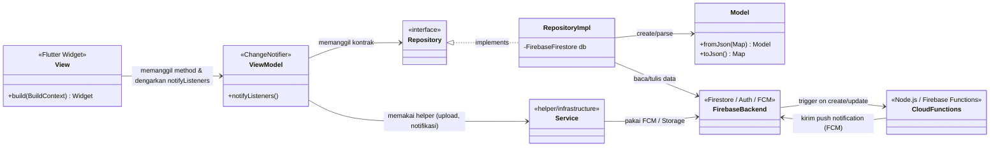
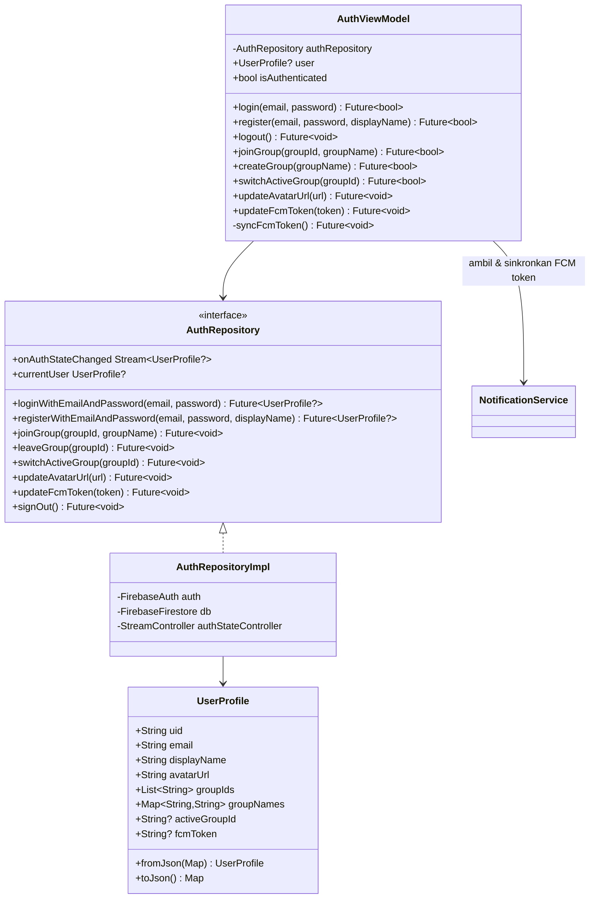
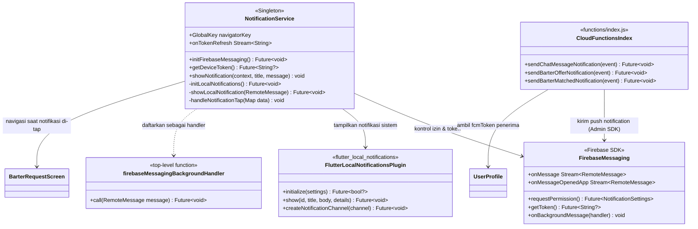
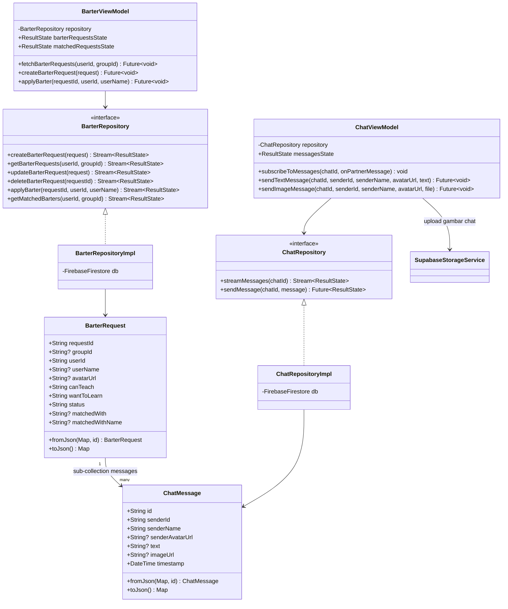
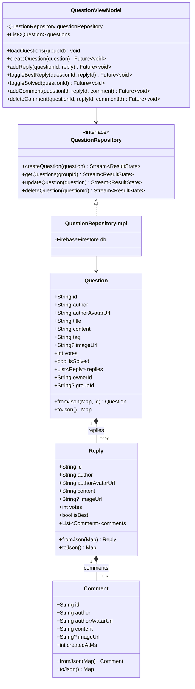
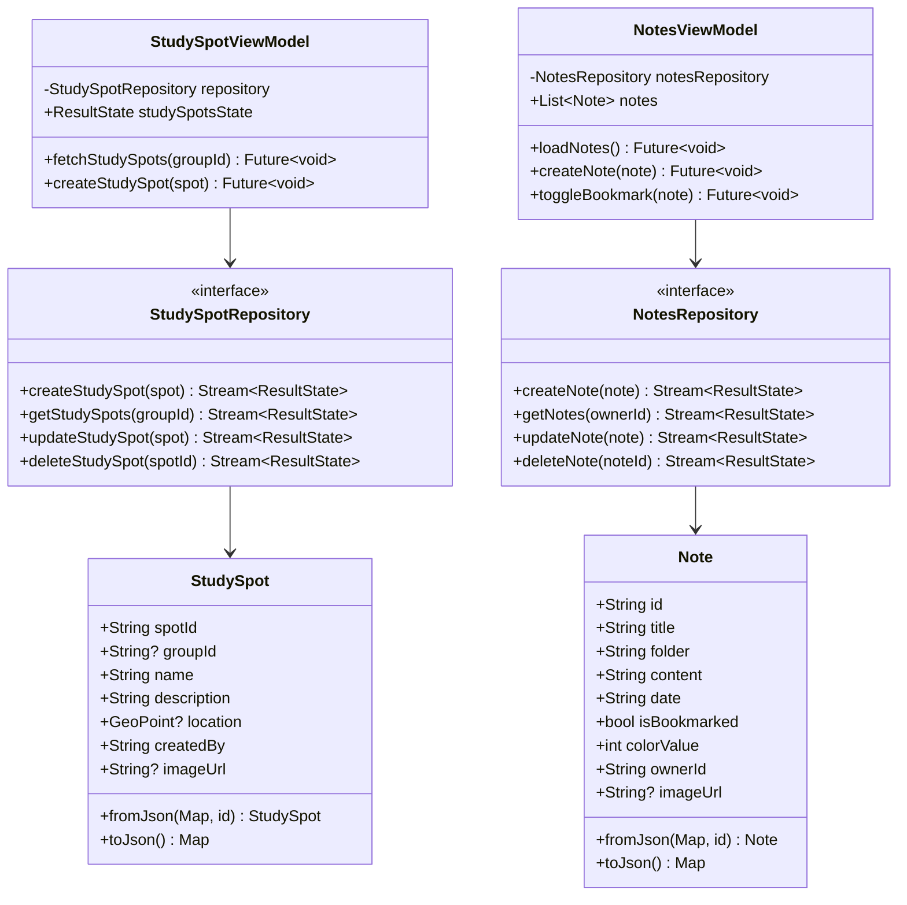
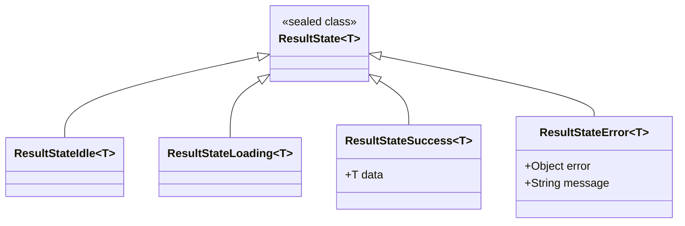

# Class Diagram - AjarinYa!

Dokumen ini menjelaskan struktur kelas aplikasi AjarinYa! yang dibangun dengan
pola arsitektur MVVM (Model - View - ViewModel) ditambah lapisan Repository
sebagai jembatan ke sumber data (Firebase Firestore, Firebase Auth, Firebase
Cloud Messaging, dan Supabase Storage).

Diagram dipisah menjadi beberapa bagian agar mudah dibaca: gambaran umum
lapisan arsitektur, lalu detail tiap modul fitur.

## 1. Gambaran Umum Lapisan Arsitektur

## 2. Modul Autentikasi dan Profil Pengguna

## 3. Modul Notifikasi (Push Notification)

## 4. Modul Skill Barter dan Chat Privat

## 5. Modul Forum Tanya Jawab

## 6. Modul Study Spot dan Notes

## 7. ResultState (Pola State Generik)

Semua repository dan ViewModel pada AjarinYa! menggunakan satu pola state
generik yang sama untuk merepresentasikan hasil operasi asinkron (loading,
sukses, atau gagal), sehingga UI selalu tahu kondisi data terkini tanpa
penanganan try-catch berulang di setiap layar.

## Catatan Implementasi Push Notification

- `UserProfile.fcmToken` disimpan di Firestore koleksi `users/{uid}` setiap
  kali pengguna login atau token dirotasi oleh Firebase.
- `NotificationService` menangani izin notifikasi, menampilkan notifikasi
  sistem (foreground maupun background), dan mengarahkan navigasi saat
  notifikasi di-tap.
- `firebaseMessagingBackgroundHandler` adalah top-level function yang
  didaftarkan ke `FirebaseMessaging.onBackgroundMessage` agar pesan FCM tetap
  diproses walau aplikasi sedang di background atau tertutup.
- Pengiriman push notification yang sesungguhnya (lintas perangkat, di luar
  aplikasi) dilakukan oleh Cloud Functions (`functions/index.js`) yang
  ter-trigger otomatis saat dokumen Firestore baru dibuat atau diubah:
  - `sendChatMessageNotification`: trigger saat ada pesan baru di
    `barter_requests/{requestId}/messages/{messageId}`.
  - `sendBarterOfferNotification`: trigger saat ada tawaran trade skill baru
    di `barter_requests/{requestId}`.
  - `sendBarterMatchedNotification`: trigger saat status tawaran berubah dari
    `PENDING` menjadi `MATCHED`.
